# Operação Lua de Mel

A Operação Lua de Mel é uma aplicação interativa desenvolvida com foco em modernizar a tradicional dinâmica de "cortar a gravata" em casamentos. Em vez da abordagem convencional, optamos por uma experiência digital e gamificada, onde os convidados participam de um sorteio online em tempo real.

O objetivo do App é gerenciar a entrada de jogadores e automatizar o sorteio de números, exibindo um ranking de classificação atualizado instantaneamente conforme as dezenas são chamadas.

Tecnologias e Funcionamento: Para garantir alta performance e atualização em tempo real (real-time), a aplicação utiliza o Firebase Firestore como banco de dados NoSQL, permitindo que todos os convidados visualizem o sorteio simultaneamente em seus próprios dispositivos. O frontend foi construído utilizando tecnologias web modernas (JavaScript ES6+, HTML5 e CSS3), garantindo um layout responsivo para smartphones e telões, proporcionando uma experiência fluida, transparente e divertida para celebrar a união de Jhon e Rê.

## Features

• Cadastrar jogador: Permite que o convidado insira seu nome para participar da dinâmica.  
• Gerar cartela aleatória: Atribui automaticamente uma tabela de números exclusivos para cada participante cadastrado.  
• Acompanhar sorteio em tempo real: Visualização instantânea dos números chamados e marcação automática na cartela do jogador.  
• Gerenciar sorteio (Painel do Organizador): Controle centralizado para realizar novos sorteios e atualizar os dados da rodada.  
• Ranking de classificação dinâmico: Exibição da pontuação de todos os jogadores em tempo real, destacando quem está mais próximo da vitória.  
• Identificar vencedor automaticamente: Sistema de validação que interrompe o jogo e anuncia o ganhador assim que uma linha ou cartela é completada.  

## Screens

### Home

    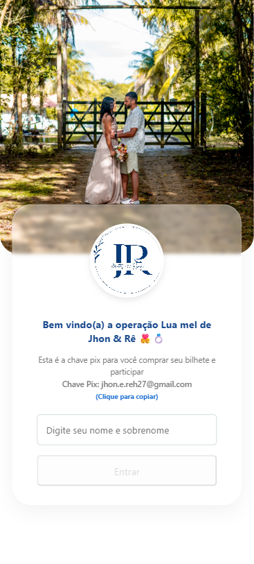
    
     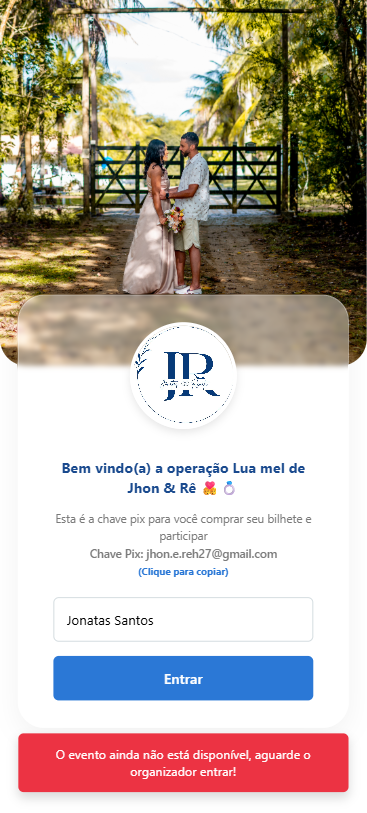

    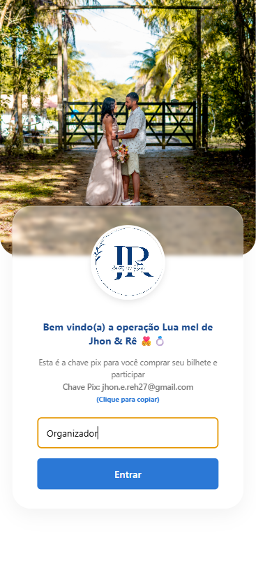
    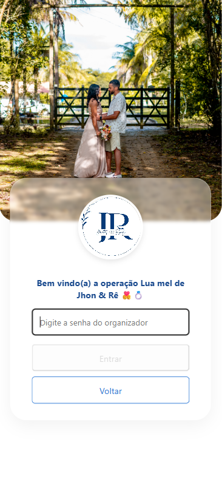
    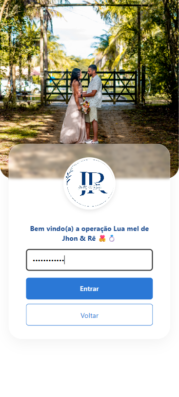

### Player

    
    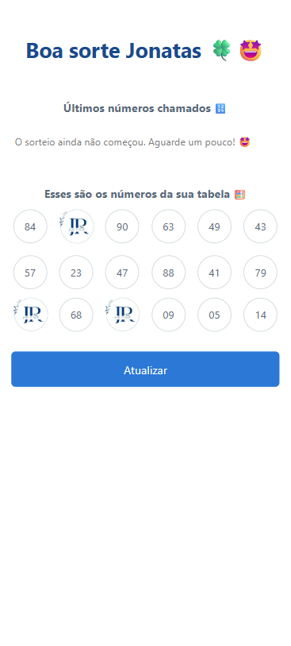
    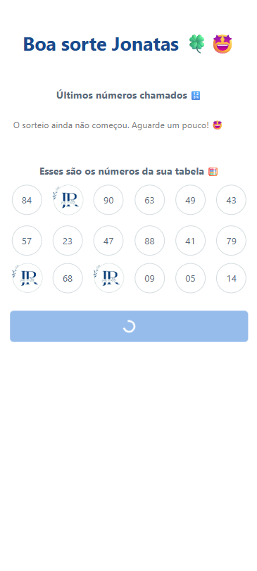   

    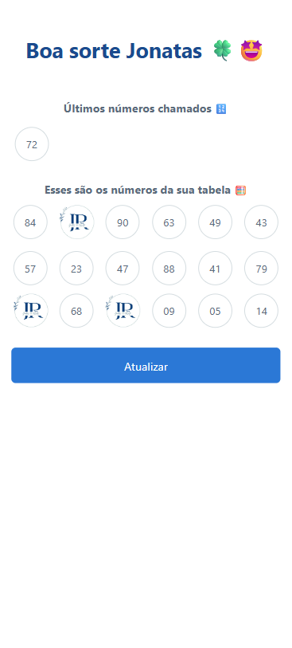
    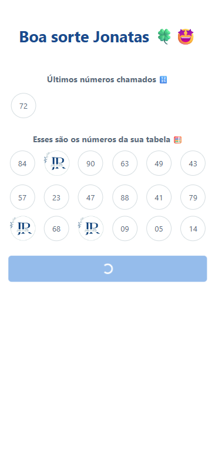
    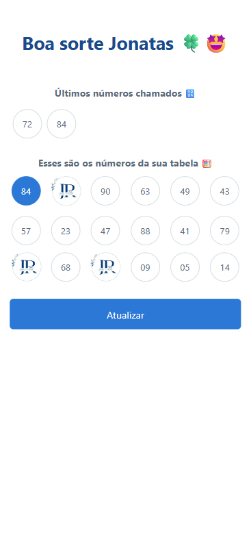

    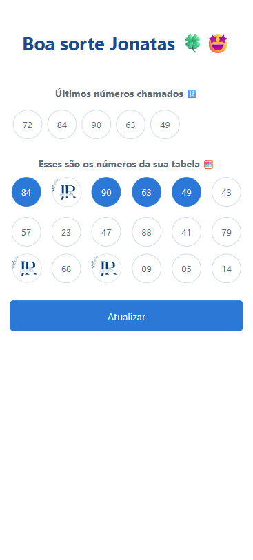
    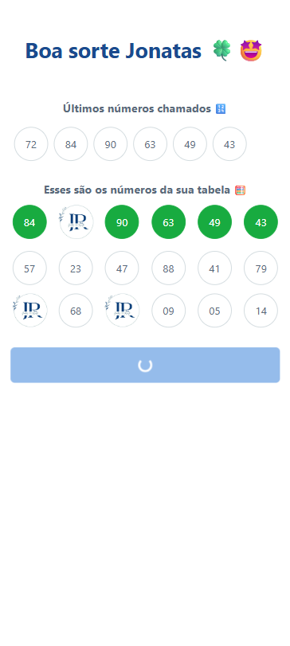
    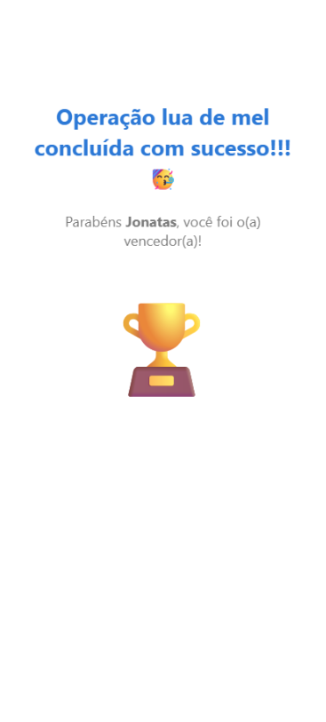

    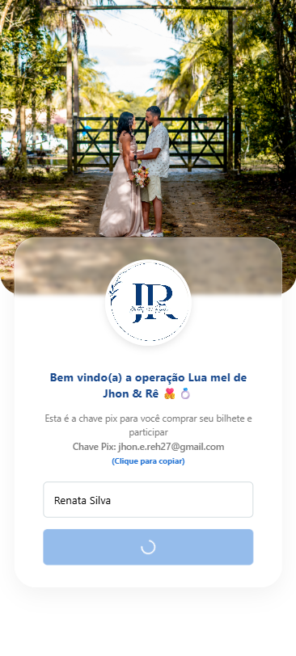
    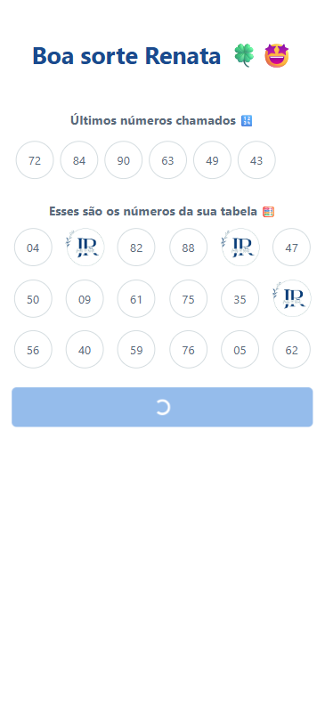
    

### Organizer

    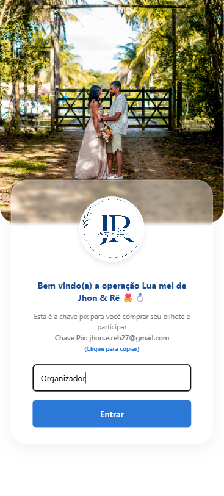
    
    

    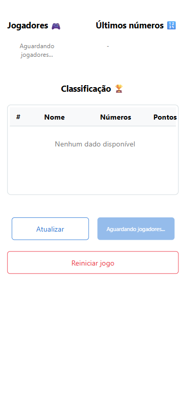
    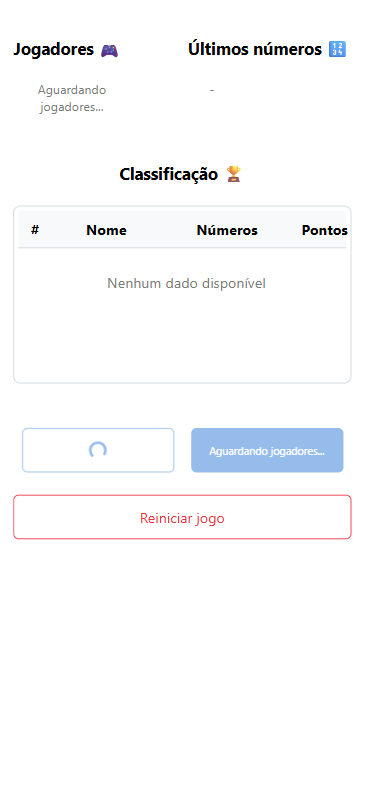
    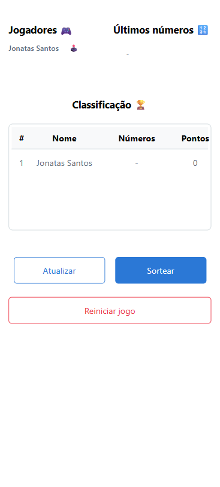

    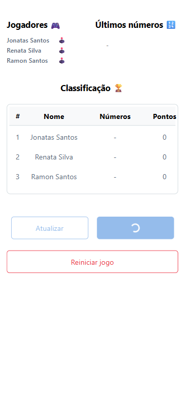
    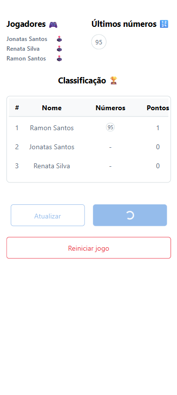
    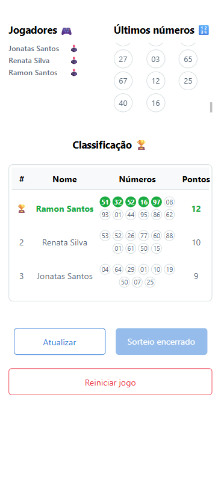

## App

    

        <h3>Organizer</h3>
        
    

    

        <h3>Player Loses</h3>
        
    

    

        <h3>Player Wins</h3>
        
    

